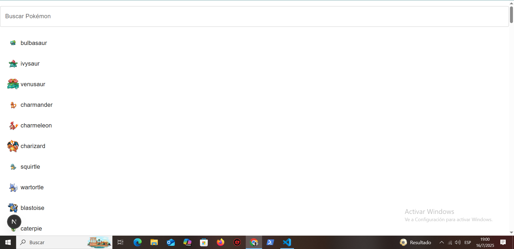

# Pokémon App 🧢

Una app web desarrollada con **Next.js**, **TypeScript** y **Material UI**, que muestra los primeros 151 Pokémon utilizando la [PokéAPI](https://pokeapi.co/).

## 📸 Captura de pantalla



> 💡 Agregá una captura del proyecto (opcional) en `/public` y renombrala como `screenshot.png`.

---

## 🚀 Características

- ⚡ App rápida gracias a Next.js
- 🔍 Lista con los primeros 151 Pokémon
- 🎨 UI moderna con Material UI
- 🧠 Arquitectura organizada
- 🔧 Preparado para agregar buscador

---

## 🛠️ Tecnologías

- [Next.js](https://nextjs.org/)
- [React](https://reactjs.org/)
- [TypeScript](https://www.typescriptlang.org/)
- [Material UI](https://mui.com/)
- [PokéAPI](https://pokeapi.co/)

---

## 📦 Instalación

Cloná el repositorio y ejecutá:

```bash
npm install
npm run dev
